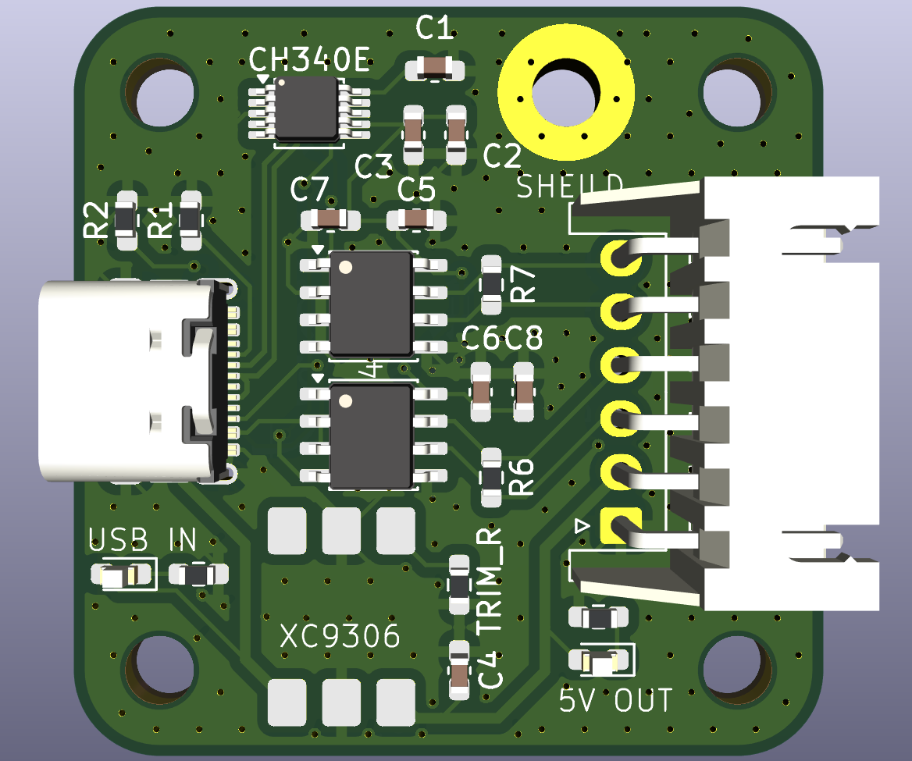
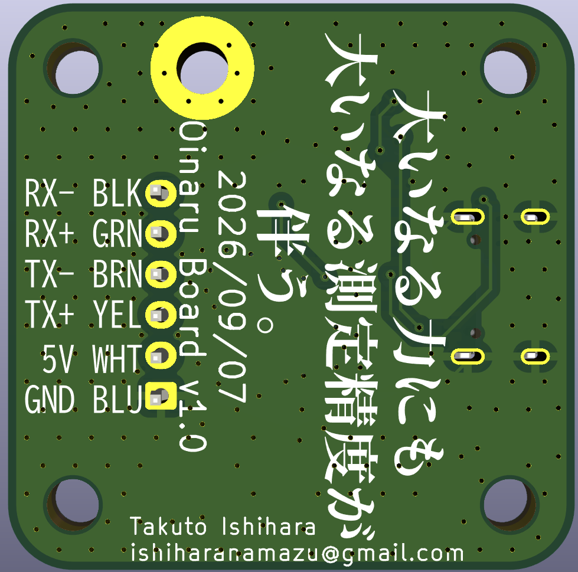

# Oinaru Board

Oinaru Boardは、USB Type-Cからセンサへ電源を供給しながら、PCとセンサ間のUSB–RS485通信を行うための変換基板です。

USB Type-Cから入力された電圧は、XC9306昇降圧DC-DCコンバータモジュールで5 Vに安定化してセンサへ供給します。

USB–UART変換にはCH340E、差動信号の送受信には2個のMAX485Eを使用し、TX±／RX±による4線式通信に対応しています。

## 特長

- USB Type-C（USB 2.0）接続
- センサへの5 V電源供給
- XC9306モジュールによるUSB入力電圧の昇降圧・安定化
- USB–RS485変換
- TX±／RX±の4線式全二重通信
- USB接続および5 V電源のLED表示
- 通信線の終端抵抗を実装可能

## 基板外観

### 表面

### 裏面

## センサ側コネクタ（XH）

| ピン | 信号 |
| ---: | :--- |
| 1 | GND |
| 2 | +5 V |
| 3 | TX+ |
| 4 | TX- |
| 5 | RX+ |
| 6 | RX- |

ピン番号はKiCadの回路図・基板データ上の番号です。実際に接続する前に、使用するセンサの仕様書と信号方向・ピン配列を照合してください。
基盤のTXはセンサのRXと接続されることに注意してください

## 使用方法

1. XHコネクタにセンサを接続します。
2. Oinaru BoardとPCをUSB Type-Cケーブルで接続します。
3. PCに認識されたCH340Eのシリアルポートを、使用するソフトウェアから開きます。
4. センサの仕様に合わせて通信速度などを設定し、通信を開始します。

## 主な構成部品

| 部品 | 用途 |
| :--- | :--- |
| CH340E | USB–UART変換 |
| MAX485E × 2 | TX／RX差動信号変換 |
| XC9306昇降圧モジュール | USB入力電圧を5 Vに安定化 |
| USB Type-Cレセプタクル | PC接続・電源入力 |
| 6ピンコネクタ | センサ接続 |

## 設計データ

- `usb_rs485_adapter.kicad_pro`：KiCadプロジェクト
- `usb_rs485_adapter.kicad_sch`：回路図
- `usb_rs485_adapter.kicad_pcb`：基板レイアウト
- `production/`：製造用出力データ

## 注意事項

- 本基板の通信部と電源部は絶縁されていません。
- センサの消費電流が、接続するUSBポートやケーブルの給電能力を超えないことを確認してください。
- 配線の誤りや極性の取り違えは、基板・センサ・PCの故障につながる可能性があります。
- 使用環境に応じて終端抵抗の値と実装状態を確認してください。
